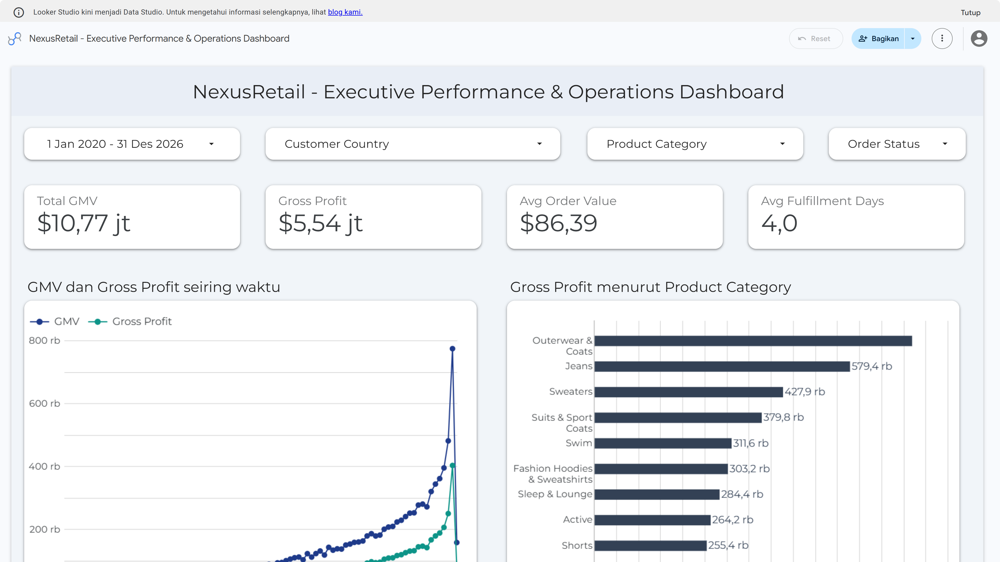

# NexusRetail: Executive Business Performance & Operations Dashboard



> 🔗 **Interactive Case Study & Analysis:** [View Complete Case Study on Portfolio](https://muda.faaris.id/portfolio/nexusretail-executive-dashboard/)  
> 📊 **Live Interactive Dashboard:** [Open Google Data Studio Dashboard](https://datastudio.google.com/reporting/2f002a24-e5dc-4b9c-9244-f2a88573801b)

---

## 1. Project Overview

NexusRetail is an online retail enterprise operating across global markets. This project provides an end-to-end cloud business intelligence solution designed to track top-line revenue growth, category profitability, and logistics fulfillment efficiency.

By transforming raw relational transaction tables in **Google BigQuery** into an optimized star-schema fact view, this project enables leadership to analyze commercial performance, monitor shipping lead times, and optimize inventory allocation.

For the full analytical breakdown, interactive charts, and strategic business takeaways, visit the [NexusRetail Case Study on muda.faaris.id](https://muda.faaris.id/portfolio/nexusretail-executive-dashboard/).

---

## 2. Business Problem & Objectives

Executive stakeholders lacked a unified reporting layer across disparate transactional records, requiring clear analytics on:
- **Revenue vs. Profit Dynamics:** Pinpointing which product categories drive high sales volume versus true gross margin.
- **Order Lead Time & Logistics Health:** Tracking end-to-end fulfillment duration to identify shipping bottlenecks across international hubs.
- **Fulfillment Leakage:** Evaluating order volume across statuses (shipped, delivered, cancelled, and returned) to reduce customer drop-off.

---

## 3. Tech Stack & Architecture

- **Data Warehouse:** Google BigQuery (Cloud SQL)
- **Data Modeling:** Star-schema analytical fact modeling using Common Table Expressions (CTEs)
- **BI & Visual Analytics:** Google Data Studio
- **Version Control:** Git & GitHub

```
[Google BigQuery Public Dataset]
  ├── orders
  ├── order_items
  ├── products
  └── users
         │
         ▼ (SQL CTEs & Unit Economics Transformation)
[Analytical Fact View: nexusretail_dw.nexusretail_sales_fact]
         │
         ▼ (BigQuery Native Connector)
[Google Data Studio Executive Dashboard]
  ├── Global Filter Bar (Date Range, Country, Category, Status)
  ├── Executive KPI Scorecards (GMV, Profit, AOV, Fulfillment)
  ├── Monthly Revenue & Profit Trend (Time Series)
  ├── Top Product Categories by Gross Profit (Horizontal Bar)
  └── Operational Order Status Breakdown (Donut Chart)
```

---

## 4. Analytical Data Modeling

The transformation script in [`sql/01_sales_fact_transformation.sql`](sql/01_sales_fact_transformation.sql) structures raw e-commerce records into a clean analytical fact layer:
1. **Unit Economics Precomputation:** Calculates item-level cost of goods sold, gross profit, and profit margin percentages directly in BigQuery.
2. **Fulfillment Lead Time Metrics:** Measures processing days, shipping days, and total delivery duration using `DATE_DIFF`.
3. **Demographic & Cohort Enrichment:** Joins customer demographic attributes to enable regional and age-bracket filtering.
4. **Query Performance Optimization:** Materializing this view significantly reduces query execution times and data scan costs in Google Data Studio.

---

## 5. How to Reproduce

1. **Clone the repository:**
   ```bash
   git clone https://github.com/faarismuda/nexusretail-executive-dashboard.git
   cd nexusretail-executive-dashboard
   ```

2. **Set up BigQuery Data Warehouse:**
   - Open the [Google BigQuery Console](https://console.cloud.google.com/bigquery).
   - Create a dataset named `nexusretail_dw` in the `US` multi-region.
   - Execute the transformation query located in [`sql/01_sales_fact_transformation.sql`](sql/01_sales_fact_transformation.sql).

3. **Connect to Google Data Studio:**
   - Open [Google Data Studio](https://datastudio.google.com/).
   - Create a new blank report and connect to BigQuery $\rightarrow$ `nexusretail_dw.nexusretail_sales_fact`.
   - Create the calculated field for **Average Order Value**:
     ```sql
     SUM(gmv) / COUNT_DISTINCT(order_id)
     ```
   - Add filter controls, scorecards, time series, and bar charts to assemble the dashboard canvas.

---

## 6. Project Links

- **Interactive Case Study:** [https://muda.faaris.id/portfolio/nexusretail-executive-dashboard/](https://muda.faaris.id/portfolio/nexusretail-executive-dashboard/)
- **Live Google Data Studio Report:** [https://datastudio.google.com/reporting/2f002a24-e5dc-4b9c-9244-f2a88573801b](https://datastudio.google.com/reporting/2f002a24-e5dc-4b9c-9244-f2a88573801b)